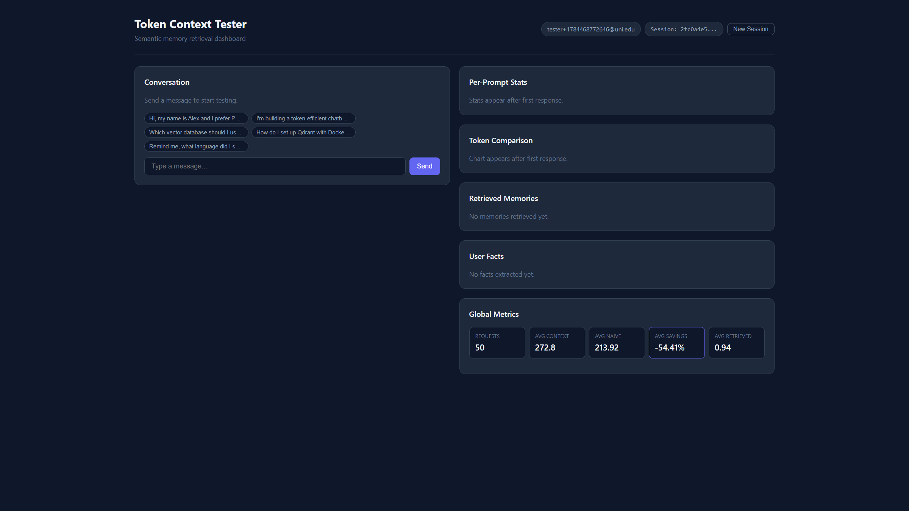
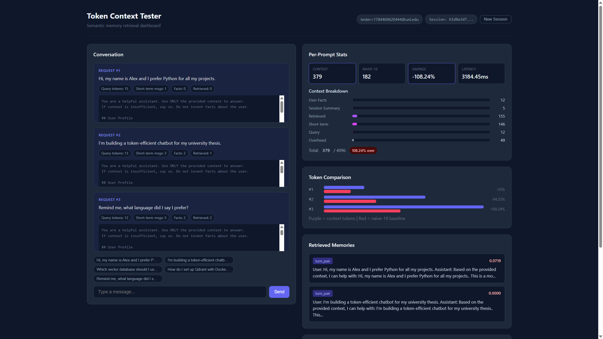

# Token-Efficient Context Management System

Replaces the naive “last 18 messages” chatbot pattern with **tiered memory + semantic retrieval**, so each turn sends only the context that matters.

Validated against university ARIA conversation logs at **~98.6% token savings** versus dumping full history (`logs_replay_results.json`).


## Problem

| Naive approach | This system |
|----------------|-------------|
| Send last 18 messages every turn | Retrieve only relevant memories |
| Context grows without bound | Summarize older turns |
| No durable user model | Persist structured user facts |
| Hard to debug token spend | Live dashboard with breakdowns |

## Stack

- **API:** FastAPI (Python)
- **Store:** PostgreSQL (messages, facts, summaries, logs)
- **Vectors:** Qdrant (768-dim cosine, BGE-base-en-v1.5)
- **Rerank:** BGE-reranker-base (CrossEncoder)
- **UI:** Vanilla HTML/CSS/JS dashboard (no npm build)

## Dashboard

Fresh session:



After a few turns (facts extracted, memories retrieved, token chart populated):



Open **http://127.0.0.1:9200/** after starting the API. Each turn shows:

- Assembled context preview (what the LLM actually receives)
- Context vs naive-18 token comparison
- Retrieved memories with scores (and “fallback” when kept for session continuity)
- Extracted user facts and global averages

## Quick start

Shortest checklist: **[run.txt](run.txt)** · Full guide: **[run.md](run.md)**

```bash
docker compose up -d
python -m venv .venv
# Windows
.venv\Scripts\activate
pip install -r requirements.txt
copy .env.example .env
python -m scripts.warmup
python -m scripts.init_db
uvicorn app.main:app --host 127.0.0.1 --port 9200
```

Then open http://127.0.0.1:9200/

> Default `.env` uses `LLM_MOCK=true` so you can test retrieval without Ollama. Set `LLM_MOCK=false` and point `LLM_BASE_URL` at a local OpenAI-compatible server for real replies.

## How context is assembled

```
Query
  → embed (BGE)
  → Qdrant ANN (top-20)
  → cross-encoder rerank
  → temporal decay
  → threshold ≥ 0.72 (same-session fallback if empty)
  → dedup → MMR top-3
  → + user facts + session summary + short-term (6–8 msgs)
  → token-budgeted prompt → LLM
```

**Memory tiers**

1. **Short-term** — recent unsummarized messages  
2. **Summaries** — triggered by token budget **or** turn count (`SUMMARIZE_TURN_THRESHOLD`)  
3. **User facts** — durable profile keys (name, prefs, goals)  
4. **Episodic** — embedded turn-pairs in Qdrant  

## Project layout

```
app/                 FastAPI backend + services
frontend/            Vanilla testing dashboard (served at /)
scripts/             warmup, init_db, smoke_test, log analysis
tests/               Pytest suite
docs/images/         README screenshots & architecture diagram
AIConversationLogs/  Sample ARIA logs for replay comparison
```

## Docs

| File | Content |
|------|---------|
| [implementation.md](implementation.md) | Architecture, pipelines, schema, config |
| [run.txt](run.txt) / [run.md](run.md) | Setup & troubleshooting |
| [test_data.md](test_data.md) | Suggested test prompts |
| [logs_issue.txt](logs_issue.txt) | Issues found in ARIA logs |
| [improvements.md](improvements.md) | Future ideas |

## Tests

```bash
pytest tests/ -v
python -m scripts.smoke_test
```

## License

MIT
