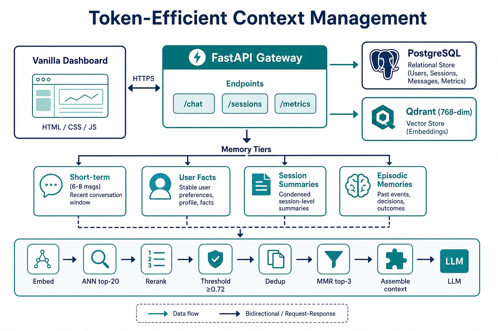

# Implementation Guide

Technical documentation for the Token-Efficient Context Management System.

## System Architecture

```
┌──────────────────┐     ┌──────────────────────────────────────────────────┐
│  Frontend        │────▶│              FastAPI Gateway                     │
│  (vanilla JS)    │     │  /chat  /users  /sessions  /metrics              │
│  served at /     │     │  StaticFiles → frontend/                         │
└──────────────────┘     └──────┬───────────────────────────┬─────────────┘
                               │                           │
                      ┌────────▼────────┐         ┌────────▼────────┐
                      │   PostgreSQL    │         │     Qdrant      │
                      │  messages       │         │  vector search  │
                      │  summaries      │         │  768-dim cosine │
                      │  facts          │         └─────────────────┘
                      │  memory_chunks  │
                      │  token_logs     │
                      └─────────────────┘
```

See also: 

## Request Lifecycle

1. **User sends message** → saved to PostgreSQL, available in short-term buffer  
2. **Query embedding** generated (BGE-base with query prefix)  
3. **Vector search** in Qdrant (top-20 candidates, filtered by `user_id`)  
4. **Rerank** with BGE-reranker CrossEncoder (scores already ~[0, 1] via Sigmoid)  
5. **Temporal decay** `exp(-λ · age_days)` × importance  
6. **Filter** by similarity threshold (≥ 0.72)  
7. **Same-session fallback** if threshold empties the list (keeps continuity)  
8. **Deduplicate** near-identical chunks (> 0.95 similarity)  
9. **MMR** select top-3 diverse results  
10. **Keyword boost** (PostgreSQL `ILIKE`) merged with vector hits  
11. **Fetch** session summary + user facts from PostgreSQL  
12. **Build context** within token budget (default 4096)  
13. **Call LLM** (or mock) with assembled system prompt + user message  
14. **Log** token usage and retrieval audit trail  
15. **BackgroundTasks**: embed turn-pair, extract facts, maybe summarize  

## Memory Tiers

### Short-Term Memory

- **Contents:** Last 6–8 raw messages of the current session  
- **Storage:** PostgreSQL `messages` (`is_summarized = false`)  
- **Usage:** Every request — pronoun resolution and follow-ups  
- **Budget:** Up to `SHORT_TERM_MAX_TOKENS` (default 1200)

### Long-Term Memory (Episodic)

- **Contents:** Embedded turn-pair chunks from prior turns  
- **Storage:** PostgreSQL `memory_chunks` + Qdrant vectors  
- **Chunk format:** `User: ...\nAssistant: ...`  
- **Usage:** Semantic search when the query references past topics  

### Persistent User Facts

- **Contents:** Structured profile (`preferred_language`, `project_goal`, …)  
- **Storage:** PostgreSQL `user_facts`  
- **Usage:** Every request (top facts by confidence)  
- **Extraction:** After each turn (LLM or mock heuristics); upserted with confidence  

### Conversation Summaries

- **Contents:** Hierarchical summaries per session  
- **Storage:** PostgreSQL `conversation_summaries` (+ optional vector index)  
- **Triggers:**  
  - Unsummarized tokens ≥ `SUMMARIZE_THRESHOLD` (default 3000), **or**  
  - Unsummarized turns ≥ `SUMMARIZE_TURN_THRESHOLD` (default 10)  
- **Process:** Batch summarize → merge → mark messages summarized  

## Retrieval Pipeline

```
Query → Embed → Qdrant ANN (top-20)
  → Cross-Encoder Rerank
  → Temporal Decay (exp(-λ * age_days))
  → Threshold Filter (≥ 0.72)
  → Same-session fallback (if empty)
  → Deduplication (> 0.95 similarity)
  → MMR Selection (top-3)
  → Keyword Boost (PostgreSQL ILIKE merge)
```

| Method | Implementation |
|--------|----------------|
| Cosine similarity | Qdrant (L2-normalized BGE vectors) |
| Cross-encoder reranking | `BAAI/bge-reranker-base` via sentence-transformers |
| MMR | λ=`MMR_LAMBDA` (default 0.5) |
| Temporal decay | λ=`TEMPORAL_DECAY_LAMBDA` (default 0.01 / day) |
| Keyword boost | PostgreSQL `ILIKE` on `memory_chunks` |

Scores below the threshold that still appear in the UI are labeled **fallback** (same-session continuity), not “passed threshold.”

## Context Construction

| Slot | Budget (defaults) | Source |
|------|-------------------|--------|
| System / overhead | ~300 + separators | Fixed template |
| User facts | 150 | `user_facts` |
| Session summary | 400 | `conversation_summaries` |
| Retrieved memories | 600 | Qdrant top-3 |
| Short-term messages | 1200 | Recent unsummarized messages |
| Query | counted | Current user message |
| **Total budget** | **4096** | vs naive last-18 baseline |

Assembly order: system → facts → summary → memories → short-term → query.

The API returns `assembled_context_preview` so the dashboard can show exactly what was sent.

## Database Schema

### PostgreSQL

| Table | Purpose |
|-------|---------|
| `users` | User accounts |
| `sessions` | Chat sessions per user |
| `messages` | Raw messages (source of truth) |
| `conversation_summaries` | Hierarchical session summaries |
| `user_facts` | Structured persistent facts |
| `memory_chunks` | Episodic memory metadata |
| `retrieval_logs` | Per-request retrieval audit |
| `token_usage_logs` | Per-request token metrics |

### Qdrant collection

```json
{
  "collection": "conversation_memory",
  "vectors": { "size": 768, "distance": "Cosine" },
  "payload": ["user_id", "session_id", "memory_type", "chunk_id", "content", "importance", "timestamp"]
}
```

## Frontend

Vanilla static assets in `frontend/`:

| File | Role |
|------|------|
| `index.html` | Layout: conversation + stats panels |
| `styles.css` | Dark dashboard styling |
| `app.js` | Session init, chat, charts, metrics |

Mounted by FastAPI `StaticFiles` at `/`. No Node/npm required for the tester UI.

## LlamaIndex Bridge (optional)

`app/services/llama_index_bridge.py` wraps:

- HuggingFace embedding configuration  
- Qdrant vector store helpers  
- Batch indexing / ContextChatEngine experiments  

Core production path uses the custom hybrid retriever in `app/services/retrieval.py`.

## Configuration Reference

| Variable | Default | Description |
|----------|---------|-------------|
| `DATABASE_URL` | `postgresql+asyncpg://...` | PostgreSQL connection |
| `QDRANT_HOST` / `QDRANT_PORT` | `localhost` / `6333` | Qdrant |
| `EMBEDDING_MODEL` | `BAAI/bge-base-en-v1.5` | Sentence-transformer |
| `RERANKER_MODEL` | `BAAI/bge-reranker-base` | Cross-encoder |
| `LLM_MOCK` | `false` | Mock LLM (set `true` for local UI tests) |
| `LLM_BASE_URL` | `http://localhost:11434/v1` | Ollama / OpenAI-compatible |
| `SIMILARITY_THRESHOLD` | `0.72` | Min rerank score to keep |
| `RETRIEVAL_TOP_K` | `3` | Final memories returned |
| `CONTEXT_TOKEN_BUDGET` | `4096` | Max context tokens |
| `SHORT_TERM_MAX_TOKENS` | `1200` | Short-term window |
| `SUMMARIZE_THRESHOLD` | `3000` | Token trigger for summarization |
| `SUMMARIZE_TURN_THRESHOLD` | `10` | Turn-count trigger |
| `API_PORT` | `9200` | Suggested uvicorn port (Windows-friendly) |

## Pseudocode: Request Handler

```python
async def handle_message(user_id, session_id, message, background_tasks):
    start = time.perf_counter()

    save_message(session_id, "user", message)
    short_term = get_short_term_messages(session_id, max_tokens=1200)

    retrieved = await retriever.retrieve(query=message, user_id=user_id, session_id=session_id)
    retrieved = await retriever.keyword_boost(db, message, retrieved, user_id)

    summary = get_latest_summary(session_id)
    facts = get_user_facts(user_id, limit=10)

    context = build_context(facts, summary, retrieved, short_term, message)
    response = llm.chat(context.system_prompt, message)

    save_message(session_id, "assistant", response)
    log_tokens(context.total_tokens, naive_baseline_18, savings)
    log_retrieval(retrieved, scores)

    background_tasks.add_task(store_turn_pair, ...)
    background_tasks.add_task(extract_facts, ...)
    background_tasks.add_task(maybe_summarize, ...)

    return ChatResponse(..., assembled_context_preview=..., latency_ms=elapsed)
```

## File Map

| File | Responsibility |
|------|----------------|
| `app/main.py` | FastAPI app, CORS, lifespan, static mount |
| `app/config.py` | Settings from `.env` |
| `app/schemas.py` | Pydantic request/response models |
| `app/models/tables.py` | SQLAlchemy ORM models |
| `app/services/chat.py` | Request orchestration |
| `app/services/embedding.py` | BGE embeddings + Qdrant ops |
| `app/services/retrieval.py` | Hybrid retriever pipeline |
| `app/services/memory.py` | Tiered memory read/write |
| `app/services/summarizer.py` | Conversation summarization |
| `app/services/context_builder.py` | Token-budgeted prompt assembly |
| `app/services/llm.py` | OpenAI-compatible / mock LLM client |
| `app/api/routes/chat.py` | `POST /chat` |
| `app/api/routes/sessions.py` | Message / facts / summary reads |
| `app/api/routes/metrics.py` | Metrics and evaluation |
| `frontend/` | Vanilla testing dashboard |
| `scripts/smoke_test.py` | End-to-end API smoke test |
| `scripts/replay_aria_logs.py` | ARIA log replay + savings report |

## Testing Notes

- Unit/integration: `pytest tests/` (21 tests)  
- Smoke: `python -m scripts.smoke_test` against a live server on port **9200**  
- Negative savings on very short mock chats are expected: system overhead can exceed a tiny naive-18 window until conversations grow  
- On Windows, prefer port **9200** — `8000`/`8080` are often blocked  

## Operational Tips

1. Run `python -m scripts.warmup` once so embedding/reranker models are cached.  
2. Restart uvicorn after code changes (models stay warm in-process).  
3. Serve the UI from the **same** uvicorn process that mounts `frontend/` — an old process will 404 static files.  
